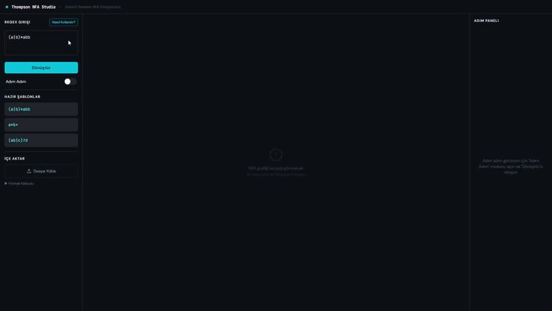
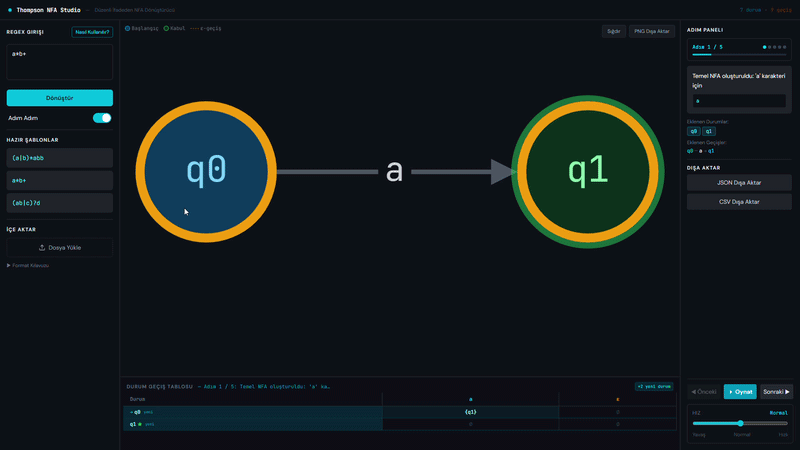

# Regex to NFA - Thompson Yöntemi

Bu proje, düzenli ifadeleri Thompson yapım algoritması ile NFA'ya dönüştüren
web tabanlı bir uygulamadır. Uygulama girilen regex ifadesini çözümler, NFA
grafiğini oluşturur, geçiş tablosunu gösterir ve istenirse dönüşüm adımlarını
animasyonlu olarak izletir.

## Uygulama Görselleri

### Başlangıç Ekranı

<p align="center">
  
</p>

### Regex'ten NFA'ya Dönüşüm

<p align="center">
  
</p>

## Proje Amacı

Bilgisayar bilimlerinde düzenli ifadeler ile sonlu otomatlar arasındaki
ilişkiyi görsel ve etkileşimli olarak göstermek hedeflenmiştir. Proje,
özellikle Thompson yapım yönteminin hangi kurallarla NFA oluşturduğunu adım
adım takip etmeyi kolaylaştırır.

## Kullanılan Teknolojiler

- React
- TypeScript
- Vite
- Cytoscape.js
- Tailwind CSS
- pnpm workspace

## Desteklenen Regex Kuralları

- Karakterler: `a`, `b`, `0`, `1` gibi tek semboller
- Birleşim: `|`
- Kleene yıldızı: `*`
- Ardışık yazım ile konkatenasyon: `ab`
- Parantez: `(a|b)`
- Artı operatörü: `+`
- Opsiyonel operatör: `?`

Örnek ifade:

```text
(a|b)*abb
```

## Temel Özellikler

- Regex ifadesini doğrulama
- Thompson yöntemiyle NFA oluşturma
- NFA grafiğini görselleştirme
- Geçiş tablosu oluşturma
- Dönüşümü adım adım izleme
- JSON, TXT, CSV ve XLSX dosya yükleme
- NFA sonucunu JSON veya CSV olarak dışa aktarma

## Kurulum

Bu proje pnpm ile çalışır.

```bash
pnpm install
```

## Çalıştırma

Geliştirme sunucusunu başlatmak için:

```bash
$env:PORT="5173"; $env:BASE_PATH="/"; pnpm --filter @workspace/thompson-nfa-studio run dev
```

Windows dışındaki terminallerde:

```bash
PORT=5173 BASE_PATH=/ pnpm --filter @workspace/thompson-nfa-studio run dev
```

## Build Alma

```bash
pnpm --filter @workspace/thompson-nfa-studio run build
```

## Önemli Dosyalar

- `artifacts/thompson-nfa-studio/src/thompson.ts`: Regex parser ve Thompson NFA algoritması
- `artifacts/thompson-nfa-studio/src/App.tsx`: Ana uygulama akışı
- `artifacts/thompson-nfa-studio/src/components/GraphView.tsx`: NFA grafiği
- `artifacts/thompson-nfa-studio/src/components/TransitionTable.tsx`: Geçiş tablosu
- `artifacts/thompson-nfa-studio/src/components/StepPanel.tsx`: Adım adım dönüşüm paneli
- `artifacts/thompson-nfa-studio/src/fileUtils.ts`: Dosya okuma ve dışa aktarma yardımcıları

## Algoritma Özeti

Uygulama önce regex ifadesini recursive descent parser ile soyut söz dizimi
ağacına ayırır. Daha sonra her düğüm için Thompson yöntemindeki kurallara
göre küçük NFA parçaları üretilir. Bu parçalar konkatenasyon, birleşim,
yıldız, artı ve opsiyonel operatörlerine göre epsilon geçişleriyle
birleştirilir. Son adımda başlangıç ve kabul durumları işaretlenerek nihai
NFA elde edilir.

## Teslim Notu

Proje, ders kapsamında düzenli ifadeden NFA oluşturma konusunu göstermek için
hazırlanmıştır. Kodlar TypeScript ile yazılmıştır ve temel algoritma
`thompson.ts` dosyasında toplanmıştır.
